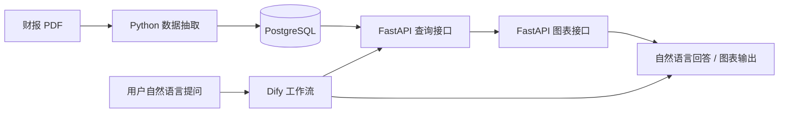

# 财报智能问数助手

从上市公司财报 PDF 中自动抽取财务数据，存入 PostgreSQL，通过 Dify 工作流实现自然语言问数。支持单公司指标查询、跨期趋势分析和多公司对比等常见财报分析场景。

## 系统架构



三层设计：**数据抽取层**（Python/PyMuPDF 解析 PDF）→ **存储层**（PostgreSQL 标准财务表）→ **问数层**（Dify + FastAPI）。

## 核心功能

- 自动识别资产负债表、利润表、现金流量表，恢复表格结构
- 规则化抽取三大财务报表字段（营业收入、净利润、总资产等）
- 自然语言问数：支持单公司查询、多年趋势、多公司对比
- 只读 SQL + 表白名单 + 关键字拦截，防止误操作

## 技术栈

| 模块 | 技术 |
|------|------|
| PDF 解析与抽取 | Python、PyMuPDF、pandas |
| 数据库 | PostgreSQL |
| 查询与图表 API | FastAPI、matplotlib |
| 智能问数 | Dify |

## 数据处理流程

```text
财报 PDF → 扫描建索引 → 定位三表 → 抽取表格块 → 规则匹配字段 → 写入 PostgreSQL
```

共 7 步，脚本位于 `scripts/`，详见 `docs/data_pipeline.md`。

## Dify 工作流

`dify/workflow_export.yml` 为脱敏模板，主链路：

```text
用户提问 → 意图识别(公司/年份/指标) → SQL 生成 → HTTP 查询 → 结果解读 / 图表生成
```

工作流设计覆盖多轮澄清、SQL 查询规划、SQL 安全审查、语义审查、HTTP 查询、结果分析、调用 `/chart` 生成图表和会话历史维护。公开仓库中的 `workflow_export.yml` 是脱敏主链路模板，导入后需要按本地 Dify 环境补全节点配置。

导入后按自己的 Dify 环境补全模型供应商和 API 地址即可。安全策略：仅允许 SELECT、表名白名单、危险关键字拦截。

## 运行方式

前置条件：Python 3.10+、PostgreSQL、本地或远程 Dify 环境。

```bash
# 1. 安装依赖
pip install -r requirements.txt

# 2. 配置环境变量
cp .env.example .env   # 填写 PostgreSQL 连接信息

# 3. 建表
psql -d financial_reports -f sql/create_tables.sql

# 4. 准备数据目录（不进入 Git）
# input/reports/   ← 财报 PDF
# input/attachment/ ← 字段字典 Excel

# 5. 执行抽取流程
python scripts/import_company.py
python scripts/import_attachment3_dict.py
python scripts/scan_reports.py
python scripts/locate_financial_statements.py
python scripts/extract_statement_blocks.py
python scripts/extract_attachment3_rule_based.py
python scripts/load_attachment3_results_to_sql.py

# 6. 启动查询 API
uvicorn api.app:app --reload --port 8000
```

API 主要接口：

- `GET /health`：健康检查
- `POST /query`：执行只读 SQL 查询
- `POST /chart`：根据查询结果生成 PNG 图表，返回 `chart_url`

图表请求样例见 `sample_data/sample_chart_request.json`。

## 示例问题与输出

| 问题 | 回答 |
|------|------|
| 示例公司 2024 年净利润多少？ | 示例公司（000999）2024 年度净利润为 **234,567.89 万元**。 |
| 对比 A 公司和 B 公司 2024 年总资产 | A 公司总资产 120 亿，B 公司 98 亿，差异 22.4%。 |
| 示例公司近三年营收趋势？ | 2022: 98 亿 → 2023: 112 亿 → 2024: 123 亿，年均增长 12%。 |

API 返回样例见 `sample_data/sample_query_result.json`。

## 项目结果

- 最近一次完整规则流水线中，关键字段非空命中率为 85.31%（14866 / 17425）
- 自然语言问数覆盖单公司查询、跨年趋势、多公司对比等场景
- 通过只读 SQL、表白名单和危险关键字拦截降低误操作与越权查询风险

## 后续优化

- [ ] 完善复杂表格（嵌套表头、跨页表）的几何恢复
- [ ] 支持港股/美股财报格式适配
- [ ] 补充更多样例数据和 Dify 对话截图
